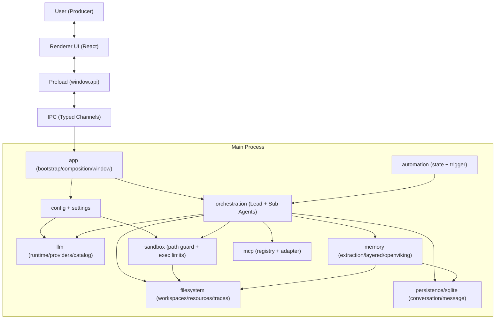

# Bandry

Bandry is a local-first AI assistant that runs on your own computer, built with `Electron + Node.js + TypeScript + React + Vite`.

## Name & Vision

`Bandry` is inspired by `Band`.

It is not a single-model chatbot. It is a collaborative band of agents:

- `Lead Agent` is the conductor, responsible for understanding goals, task decomposition, and overall pacing.
- `Sub-Agents` are the musicians, each specializing in research, execution, or writing.
- `Memory` is the score and rehearsal log, preserving long-term knowledge for continuous reuse.
- `Filesystem` is the stage and studio, making each creation process traceable and reviewable.
- `Automation` is the metronome and tour schedule, driving tasks forward with state machines and triggers, even across interrupted sessions.
- `User` is the producer, always in control of direction and final decisions.

Core goal: build an AI system that collaborates with you long-term in your local environment, accumulates context and experience over time, and understands you better the more you use it.

Bandry is currently a personal exploratory project. It is inspired by OpenClaw and CAMEL-AI, and rooted in the `one-person company` mindset: with the right agent architecture, an individual can operate with the leverage and execution bandwidth of a small team. Bandry is building that "band" to continuously amplify both the builder and the user through coordinated agents, persistent memory, and automation.

## Architecture Blueprint



Bandry runs in a closed loop:
`user intent -> orchestration -> tool execution -> memory consolidation -> better decisions next time`.

## Design Principles

1. `Local-first`: critical state, workspaces, and data stay under local control.
2. `Orchestration over Monolith`: multi-agent collaboration replaces a single black-box model.
3. `Memory compounds`: long-term memory is not log accumulation, but a reusable and retrievable capability asset.
4. `Safety by default`: sandbox path constraints, command limits, and HITL approval come first.
5. `Typed boundaries`: explicit type contracts reduce complexity across processes and modules.

## Prerequisites

- Node.js 22+
- pnpm 10+

## Quick Start

```bash
pnpm install
pnpm dev
```

If pnpm blocks postinstall scripts during first-time setup:

```bash
pnpm approve-builds
```

## Common Commands

```bash
pnpm dev          # Development mode (renderer/main/electron in parallel)
pnpm build        # Production build
pnpm test         # Run tests
pnpm typecheck    # TypeScript checks
pnpm lint         # ESLint checks
pnpm clean        # Clean dist artifacts
```

## Architecture Overview

Electron multi-process layout:

- `src/main`: main-process backend capabilities (config, IPC, orchestration, models, sandbox, storage, etc.)
- `src/preload`: secure bridge for `window.api`
- `src/renderer`: React frontend UI
- `src/shared`: shared types between main and renderer (including IPC contracts)

Current `src/main` domain structure:

- `app`: app bootstrap, composition root, window lifecycle
- `ipc`: channel registration and event bus
- `orchestration`: chat agents and workflow orchestration (including DAG workers)
- `llm`: model runtime, provider adapters, model catalog
- `memory`: memory extraction, layered memory, OpenViking integration
- `sandbox`: sandboxed file and command execution
- `persistence/sqlite`: conversation and message storage
- `settings`: global settings and model onboarding
- `config`: layered config loading and normalization
- `mcp`, `automation`, `common`: extension and shared capabilities

## Testing Convention

- Test framework: Vitest
- Test file pattern: `src/**/tests/**/*.test.ts`
- Convention: place tests under each module's `tests/` directory, not as sibling `*.test.ts` files

Example:

```bash
pnpm test
pnpm test sandbox-service.test.ts
```
