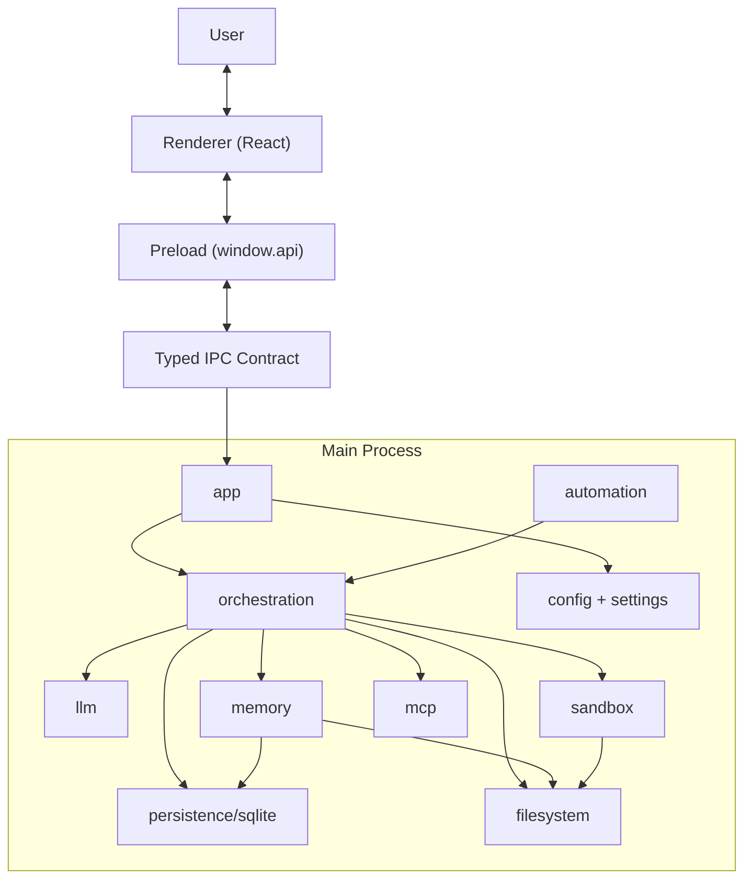

# Bandry Blueprint（核心方案与落地状态）

> 本文是 Bandry 的架构蓝图文档，面向“核心设计方案 + 当前落地状态 + Roadmap”。
> 以 2026-02-23 的代码状态为快照，后续按迭代更新。

## 0. 项目定位

Bandry 是一个个人探索性项目。

项目灵感来自 OpenClaw 与 CAMEL-AI，并认同 `one-person company` 理念：
通过一套可长期演进的本地智能体系统，让个人获得接近小团队的协作与执行能力。

`Bandry` 取自 `Band`（乐队）：

- Lead Agent 像指挥，负责目标理解、任务拆解与节奏控制。
- Sub-Agents 像乐手，按角色分工协作执行。
- Memory 像乐谱与排练记录，沉淀长期知识。
- Filesystem 像舞台与录音棚，保证过程可追溯、可复盘。
- Automation 像节拍器与排期系统，推动任务持续运行。
- User 也就是你，像制作人，始终拥有最终决策权。

### AI 原生开发模式

当前项目约 99% 由开发者借助多种 AI coding agent 完成。
目标是在 Bandry beta 版完成后，由 Bandry 基于本蓝图进行自主迭代。

### 致谢 / Acknowledgements

Bandry 向以下开源项目与社区致谢：

- OpenClaw
- CAMEL-AI
- OpenCode（`opencode`）
- DeerFlow

部分实现思路与产品方向受其启发，感谢所有贡献者。

## 1. 文档边界

本文分为两个层次：

1. `Core Design`：长期有效的架构原则与模块职责。
2. `Delivery Status`：当前已落地能力与未完成项（Roadmap）。

说明：本文重点描述架构与方案，不展开具体代码实现细节。

## 2. 核心设计原则

1. `Local-first`：关键状态、工作区与数据在本地可控范围内运行。
2. `Orchestration over Monolith`：多 Agent 协作优于单一黑盒模型。
3. `Memory compounds`：长期记忆是可检索、可复用的能力资产。
4. `Safety by default`：沙箱约束、命令限制、风险审批优先。
5. `Typed boundaries`：跨进程与跨模块通过类型契约收敛复杂度。

## 3. 总体架构（方案）



闭环目标：
`用户意图 -> 编排执行 -> 工具操作 -> 记忆沉淀 -> 下一轮更优决策`。

## 4. 核心子系统设计与状态

### 4.1 Orchestration（编排层）

设计目标：

- 由 Lead 负责规划，Sub-Agents 按角色执行，支持 DAG 依赖与并发控制。
- 对用户保持统一会话体验，对内部按任务拆解执行。

当前状态：

- `已实现`：基于 Tool Planning 的主链路（chat 与 task 两条执行路径）。
- `已实现（未接主链）`：DAG 调度、Worker Pool、Sub-Agent 框架代码已存在。
- `规划中`：将 DAG 多 Agent 主链路与现有 chat 主链统一。

### 4.2 Sandbox & Risk Control（沙箱与风险控制）

设计目标：

- 文件系统访问与命令执行必须受路径与策略约束。
- 高风险操作支持人工确认（HITL）能力。

当前状态：

- `已实现`：路径守卫、命令白名单、执行超时、输出限制、审计日志能力。
- `已实现（能力原型）`：HITL 相关中间件原型存在。
- `规划中`：将 HITL 策略完整接入主链路并细化策略分级。

### 4.3 Memory（长期记忆）

设计目标：

- 提供可沉淀、可检索的长期记忆体系（L0/L1/L2 思路）。
- 将对话事实提取为可复用知识，避免上下文重复消耗。

当前状态：

- `已实现`：Fact Extractor、Layered Memory Provider、OpenViking 集成骨架。
- `已实现`：Memory 相关配置层与路由角色（如 fact extractor 角色）。
- `规划中`：更细粒度的记忆检索策略与跨流程复用能力。

### 4.4 Filesystem（本地数据平面）

设计目标：

- 工作区数据可追溯、可复盘、可迁移。
- 资源、日志、追踪、任务中间产物职责分离。

当前状态：

- `已实现`：Bandry Home 路径规划、配置化路径覆盖、工作区与追踪目录能力。
- `规划中`：更完善的任务资产治理与清理策略。

### 4.5 Automation（自动化与任务推进）

设计目标：

- 支持事件驱动触发（A -> B）与计划调度并存。
- 后台持续推进任务，不依赖单次会话生命周期。

当前状态：

- `已实现`：Task State Machine、Trigger Engine 基础能力。
- `规划中`：`node-cron` 调度器（将补充为定时任务派发能力）。
- `TODO`：任务状态模型将重新梳理（见第 8 节）。

### 4.6 MCP（工具协议层）

设计目标：

- 统一 MCP Server 接入、发现、调用与治理。
- 将外部工具能力以标准接口纳入编排系统。

当前状态：

- `已实现（骨架）`：MCP Registry 与 Adapter 结构。
- `未落地`：Server 启停、工具发现、工具执行链路尚未完成。

### 4.7 Config & Settings（配置与模型接入）

设计目标：

- 单一配置入口，分层合并，避免业务模块直接依赖环境变量。
- 支持模型目录、接入、默认路由与全局设置统一管理。

当前状态：

- `已实现`：default -> project -> user -> env 分层加载。
- `已实现`：模型目录、模型连接、默认模型切换、凭据更新相关能力。
- `已实现`：配置持久化与摘要输出能力。

### 4.8 IPC（跨进程协议层）

设计目标：

- 通过 typed contract 统一主进程与渲染进程通信。
- preload 暴露稳定的 `window.api`，避免渲染层直接接触敏感能力。

当前状态：

- `已实现`：chat/task/sandbox/models/settings/conversation/message 等主通道体系。
- `规划中`：随着编排与自动化升级，扩展更细粒度事件协议。

### 4.9 Persistence（持久化）

设计目标：

- 以 SQLite 作为本地可靠存储，承载会话、消息与相关元数据。

当前状态：

- `已实现`：SQLite schema、会话/消息存储、IPC 对接。
- `已实现（基础）`：模型/员工相关表结构已纳入 schema。

### 4.10 Channels（外部消息通道）

设计目标：

- 将外部 IM 平台（飞书、Slack 等）的消息统一接入编排层，复用已有 ChatAgent 能力。
- 提供 Channel 抽象接口，新平台只需实现 `start/stop/sendReply/onMessage`。
- 支持 Headless Gateway 模式，无需 Electron 即可独立运行通道服务。

当前状态：

- `已实现`：Channel 抽象接口与 ChannelManager 生命周期管理。
- `已实现`：飞书（Lark）通道，基于 WebSocket 长连接接收消息、REST API 回复。
- `已实现`：消息命令解析（`/think`、`/agents`、`/model:<id>`）。
- `已实现`：Headless Gateway 入口（`src/main/gateway.ts`，`pnpm gateway` 启动）。
- `已实现`：配置层支持（环境变量 `CHANNELS_ENABLED`、`FEISHU_*`）。
- `规划中`：更多平台适配（Slack、Discord 等）。
- `规划中`：渲染进程通道状态展示（preload 桥接 `channel:status` 事件）。

### 4.11 Skills（能力包协议层）

设计目标：

- 提供可复用的 Skill 能力包体系（提示词、模板、工作流约束、可选脚本资产）。
- 建立统一的 Skills Registry，与 MCP 一样具备“发现、注册、装配、治理”能力。
- 与编排层深度集成：按任务/角色动态装配 Skills，提升子智能体稳定性与一致性。

当前状态：

- `规划中`：Skill Manifest 规范（元数据、版本、依赖、能力边界）设计。
- `规划中`：Skills 加载与优先级机制（内置 / 项目 / 用户）设计。
- `规划中`：Skills 与 MCP 的协同策略（技能负责“认知与流程”，MCP 负责“外部工具执行”）落地。

## 5. 本地目录结构（按现状）

```text
~/.bandry/
├── config/
│   ├── config.json                # 用户配置（推荐路径）
│   └── bandry.db                  # SQLite 数据库
├── logs/
│   ├── model-audit.log            # 模型调用审计日志
│   └── sandbox-audit.log          # 沙箱审计日志
├── resources/                     # 记忆资源与知识沉淀
├── plugins/                       # 插件/MCP 扩展目录
├── traces/                        # 任务追踪与状态记录
└── workspaces/                    # 任务工作区
    └── task_*/
        ├── input/
        ├── staging/
        └── output/
```

项目侧配置路径：

- 推荐：`<project>/.bandry/config.json`
- 兼容：`<project>/config.json`

用户侧兼容路径：

- 兼容：`~/.config/bandry/config.json`

## 6. `src/main` 模块布局（已落地）

```text
src/main/
├── app/
├── automation/
├── channels/          # 外部消息通道（飞书等）
│   └── feishu/
├── common/
├── config/
├── ipc/
├── llm/
├── mcp/
├── memory/
├── orchestration/
├── persistence/sqlite/
├── sandbox/
├── settings/
└── gateway.ts         # Headless 通道网关入口
```

说明：上述模块化结构已完成重组，测试约定为模块内 `tests/` 目录。

## 7. IPC 架构说明（方案级）

Bandry 的 IPC 采用三层分工：

1. `shared`：协议与类型定义（单一事实来源）。
2. `preload`：以 `window.api` 暴露受控接口。
3. `main/ipc`：统一注册通道、执行业务编排并广播事件。

设计要求：

- 协议稳定优先，尽量保持向后兼容。
- 对渲染进程只暴露必要能力与必要参数。
- 事件更新与请求响应分离，便于演进长任务与流式过程。

## 8. 任务状态模型（TODO）

> 本节先留空，后续统一梳理状态模型。

TODO：

- 定义“内部状态机”与“对外 IPC 状态”的边界与映射关系。
- 统一 chat/task/automation 三条路径的状态语义。
- 明确可恢复状态、可重试状态与终态定义。

## 9. Roadmap（分层视图）

### 9.1 已实现（可用能力）

- 主进程模块化重组（app/ipc/orchestration/llm/memory/sandbox/persistence/settings/config/mcp/automation）。
- Typed IPC + preload 桥接主链路。
- 模型接入与设置管理基础能力。
- 工具规划型 chat 与本地任务执行能力。
- SQLite 会话与消息存储。
- 配置分层与路径系统。
- Channel 通道抽象与飞书集成、Headless Gateway。

### 9.2 已实现但未完全接入主链

- DAG 多 Agent 调度与 Worker 执行框架。
- HITL 中间件能力原型。
- 自动化状态机与触发引擎基础实现。
- MCP Registry/Adapter 架构骨架。

### 9.3 规划中（下一阶段）

- `node-cron` 定时调度能力接入。
- DAG 主链路接入与统一编排入口。
- MCP Server 生命周期与工具执行链路落地。
- Skills Registry 与 Skill Manifest 规范落地。
- Skills 装配机制接入编排层，并与 MCP 形成协同执行链路。
- 任务状态模型统一与可观测性增强。
- 记忆检索/压缩策略进一步工程化。

## 10. 更新策略

每次架构调整时，按以下顺序更新本文：

1. 更新“核心子系统设计与状态”。
2. 更新“本地目录结构（按现状）”。
3. 更新“Roadmap（已实现/未实现）”。
4. 若状态模型变更，更新第 8 节 TODO 为正式定义。
