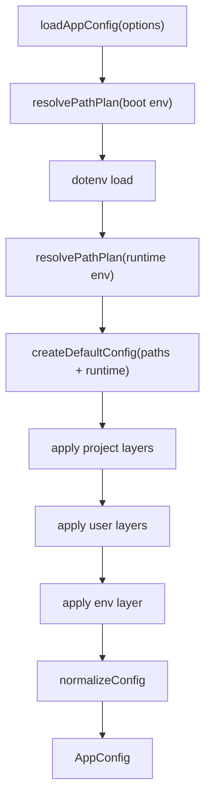

# Bandry 配置系统技术方案（完整稿）

## 1. 背景与目标

当前项目已从“`.env` 直读 + 局部配置模块混用”重构为统一配置架构，核心目标：

1. 单一配置入口，消除分散读取导致的不一致行为。
2. 对齐 `docs/blue-print.md` 的本地目录设计（`~/.bandry`）。
3. 保持对历史配置路径的兼容，支持平滑迁移。
4. 为后续新增配置项提供稳定、可测试、可审计的扩展规范。

## 2. 设计原则

1. 单一事实源：主进程只使用 `AppConfig`，不直接访问 `process.env`。
2. 分层覆盖：低优先级提供默认，高优先级精确覆盖。
3. 向后兼容：读取新路径同时兼容 legacy 路径。
4. 归一化与兜底：对路径、数值、列表和别名进行统一清洗。
5. 可观测与可测试：关键规则必须有自动化测试覆盖。

## 3. 总体架构

配置主入口：`/Users/hozzz/workspace/agent/src/main/config/load-config.ts`



## 4. 配置层级与优先级

固定优先级（从低到高）：

1. `default`：代码默认值（`createDefaultConfig`）。
2. `project`：项目配置文件（新路径 + legacy 路径）。
3. `user`：用户配置文件（新路径 + legacy 路径）。
4. `env`：`.env` 与进程环境变量。

冲突时以高优先级覆盖低优先级。

## 5. 配置源与路径策略

### 5.1 新推荐路径

1. 项目配置：`<project>/.bandry/config.json`
2. 用户配置：`~/.bandry/config/config.json`

### 5.2 兼容 legacy 路径

1. 项目 legacy：`<project>/config.json`
2. 用户 legacy：`~/.config/bandry/config.json`

### 5.3 `.env` 路径

默认：`<project>/.env`  
可通过 `BANDRY_DOTENV_PATH` 覆盖。

### 5.4 默认数据根目录（对齐 blue-print）

默认 `BANDRY_HOME=~/.bandry`，派生：

1. `configDir`: `~/.bandry/config`
2. `logsDir`: `~/.bandry/logs`
3. `workspacesDir`: `~/.bandry/workspaces`
4. `resourcesDir`: `~/.bandry/resources`
5. `pluginsDir`: `~/.bandry/plugins`
6. `traceDir`: `~/.bandry/traces`
7. `databasePath`: `~/.bandry/config/bandry.db`
8. `auditLogPath`: `~/.bandry/logs/model-audit.log`
9. `sandboxAuditLogPath`: `~/.bandry/logs/sandbox-audit.log`

说明：`workspaceDir` 当前默认为 `workspacesDir`，即沙盒允许的主工作区根目录。

## 6. 关键类型定义

主类型文件：`/Users/hozzz/workspace/agent/src/main/config/types.ts`

1. `AppConfig`：最终运行时配置对象。
2. `ConfigLayer`：单层可选配置。
3. `AppPaths`：所有路径字段。
4. `RuntimeConfig`：运行时辅助配置（`devServerUrl`、`inheritedEnv`）。

配置域包含：

1. `llm`
2. `sandbox`
3. `providers`（`openai`、`deepseek`、`volcengine`）
4. `features`
5. `openviking`
6. `paths`
7. `runtime`

## 7. 环境变量映射规则

解析入口：`/Users/hozzz/workspace/agent/src/main/config/env-layer.ts`

### 7.1 LLM 相关

1. `LLM_DEFAULT_PROVIDER`（支持 `bytedance` 别名）
2. `LLM_DEFAULT_MODEL`
3. `LLM_TIMEOUT_MS`
4. `LLM_MAX_RETRIES`
5. `LLM_RETRY_BASE_MS`
6. `LLM_RATE_LIMIT_RPS`
7. `NETWORK_MODE`
8. `OFFLINE_NON_MODEL_ONLY`
9. `LLM_AUDIT_LOG_ENABLED`
10. `PII_REDACTION_ENABLED`

### 7.2 Provider 相关

1. OpenAI：`OPENAI_API_KEY`、`OPENAI_BASE_URL`、`OPENAI_ORG_ID`、`OPENAI_MODEL`
2. DeepSeek：`DEEPSEEK_API_KEY`、`DEEPSEEK_BASE_URL`、`DEEPSEEK_MODEL`
3. Volcengine：`VOLCENGINE_*`，兼容 `BYTEDANCE_*`

### 7.3 Sandbox 相关

1. `SANDBOX_VIRTUAL_ROOT`
2. `SANDBOX_ALLOWED_WORKSPACES`
3. `SANDBOX_ALLOWED_COMMANDS`
4. `SANDBOX_EXEC_TIMEOUT_MS`
5. `SANDBOX_MAX_OUTPUT_BYTES`
6. `SANDBOX_AUDIT_LOG_ENABLED`

### 7.4 OpenViking 相关

1. `OPENVIKING_ENABLED`
2. `OPENVIKING_HOST`
3. `OPENVIKING_PORT`
4. `OPENVIKING_API_KEY`
5. `OPENVIKING_SERVER_COMMAND`
6. `OPENVIKING_SERVER_ARGS`
7. `OPENVIKING_START_TIMEOUT_MS`
8. `OPENVIKING_HEALTHCHECK_INTERVAL_MS`
9. `OPENVIKING_MEMORY_TOP_K`
10. `OPENVIKING_MEMORY_SCORE_THRESHOLD`
11. `OPENVIKING_COMMIT_DEBOUNCE_MS`
12. `OPENVIKING_TARGET_URIS`

### 7.5 Path 相关

1. `BANDRY_HOME`
2. `BANDRY_CONFIG_DIR`
3. `BANDRY_LOG_DIR`
4. `BANDRY_WORKSPACE_DIR`
5. `BANDRY_WORKSPACES_DIR`
6. `BANDRY_RESOURCES_DIR`
7. `BANDRY_PLUGINS_DIR`
8. `BANDRY_TRACE_DIR`
9. `BANDRY_DB_PATH`
10. `BANDRY_AUDIT_LOG_PATH`
11. `BANDRY_SANDBOX_AUDIT_LOG_PATH`
12. `BANDRY_PROJECT_CONFIG_PATH`
13. `BANDRY_USER_CONFIG_PATH`
14. `BANDRY_DOTENV_PATH`

### 7.6 Runtime 辅助

1. `VITE_DEV_SERVER_URL` -> `config.runtime.devServerUrl`

## 8. JSON 配置文件格式

解析入口：`/Users/hozzz/workspace/agent/src/main/config/json-layer-reader.ts`

示例（项目或用户配置均可）：

```json
{
  "llm": {
    "defaultProvider": "openai",
    "defaultModel": "gpt-4.1-mini",
    "timeoutMs": 60000
  },
  "providers": {
    "openai": {
      "enabled": true,
      "baseUrl": "https://api.openai.com/v1",
      "model": "gpt-4.1-mini"
    }
  },
  "sandbox": {
    "virtualRoot": "/mnt/workspace",
    "allowedCommands": ["ls", "cat", "mkdir", "echo"]
  },
  "paths": {
    "workspacesDir": "/Users/<user>/.bandry/workspaces"
  }
}
```

## 9. 合并与归一化规则

### 9.1 合并

入口：`/Users/hozzz/workspace/agent/src/main/config/layer-merger.ts`

1. `ConfigLayer` 只覆盖提供的字段。
2. `providers` 使用 provider 名解析器，`bytedance` 自动映射为 `volcengine`。

### 9.2 归一化

入口：`/Users/hozzz/workspace/agent/src/main/config/normalize-config.ts`

1. 路径统一 `path.resolve`。
2. 超时、重试、速率等数值做下限/范围保护。
3. `sandbox.virtualRoot` 规范化为 `/...` 且去尾斜杠。
4. `allowedWorkspaces` 去重，且保证包含 `paths.workspaceDir`。
5. `allowedCommands` 归一化为小写去重列表。
6. 若 `llm.defaultModel` 为空，回退到默认 provider 的 model。
7. provider `baseUrl` 去尾斜杠。
8. OpenViking 参数范围、列表去重与默认值补齐。
9. `runtime.inheritedEnv` 归一化为 string map。

## 10. 运行时使用规范

禁止在业务模块直接读取 `process.env`。  
统一从 `AppConfig` 获取运行时信息：

1. Electron dev URL：`config.runtime.devServerUrl`
2. Sandbox 子进程环境：`config.runtime.inheritedEnv`
3. OpenViking 子进程环境：`config.runtime.inheritedEnv`

已改造模块：

1. `/Users/hozzz/workspace/agent/src/main/index.ts`
2. `/Users/hozzz/workspace/agent/src/main/sandbox/sandbox-service.ts`
3. `/Users/hozzz/workspace/agent/src/main/openviking/process-manager.ts`

## 11. 迁移策略

### 11.1 现状

系统自动兼容读取 legacy 配置路径，无需强制一次性迁移。

### 11.2 建议迁移步骤

1. 将项目配置移动到 `<project>/.bandry/config.json`。
2. 将用户配置移动到 `~/.bandry/config/config.json`。
3. 保留 legacy 文件一段时间（只读），确认行为一致后删除。

### 11.3 风险控制

1. 先迁移非密钥字段（如超时、命令白名单）。
2. 再迁移 provider key/baseUrl/model。
3. 通过 `window.api.getConfigSummary()` 在 UI 验证生效结果。

## 12. 扩展规范（新增配置项必须遵循）

新增任何配置项时，按以下顺序改造：

1. 在 `types.ts` 增加 `AppConfig` 与 `ConfigLayer` 字段。
2. 在 `default-config.ts` 添加默认值。
3. 在 `env-layer.ts` 添加环境变量映射。
4. 在 `json-layer-reader.ts` 添加文件层映射。
5. 在 `layer-merger.ts` 添加覆盖逻辑。
6. 在 `normalize-config.ts` 添加归一化与边界保护。
7. 在 `load-config.test.ts` 添加优先级与边界测试。
8. 更新本文档与 `README.md`。

## 13. 测试与验收

核心测试文件：`/Users/hozzz/workspace/agent/src/main/config/load-config.test.ts`

至少覆盖：

1. 分层优先级（env > user > project > default）
2. legacy 路径兼容
3. `BANDRY_*` 路径覆盖
4. provider alias 映射
5. sandbox 覆盖与白名单归一化
6. feature flags
7. OpenViking 参数覆盖
8. runtime 字段注入

## 14. 当前限制与后续建议

1. `~` 不会在 JSON/ENV 中自动展开，建议使用绝对路径。
2. `workspaceDir` 与 `workspacesDir` 当前含义接近，后续可进一步语义拆分。
3. 如需支持配置热更新，建议引入配置版本号与 watcher，并保证线程安全刷新。

## 15. 快速检查清单

1. 是否只在 `loadAppConfig` 内读取环境变量。
2. 是否满足 `default -> project -> user -> env`。
3. 是否兼容 legacy 配置路径。
4. 是否对路径和数值进行了 normalize。
5. 是否为新增字段补了单测和文档。
