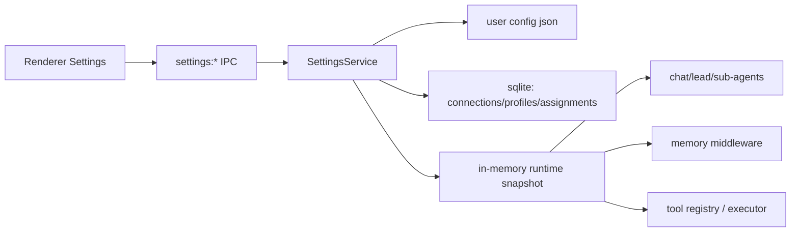

# 全局配置管理技术方案（前端改造 + 前后端交互）

## 1. 目标与范围

本方案用于落地 Bandry 的“全局可视化配置管理”，覆盖：

1. 模型接入管理（第一批：DeepSeek、火山引擎 Ark、ChatGPT/OpenAI，统一按 OpenAI Compatible 协议接入）。
2. 模型路由管理（先全局接入模型，再分配给 LeadAgent、数字员工等运行角色）。
3. 记忆能力配置（OpenViking 与 memory middleware 的可视化开关与参数配置）。
4. 工具配置（第一批只做内部工具：`web_search`、`web_fetch`，不做 MCP）。

明确不在本期实现：

1. Prompt 管理界面。
2. MCP 服务接入管理。

## 2. 关键设计决策

### 2.1 密钥存储策略

采用“可快速上线 + 可升级”的两层策略：

1. 第一阶段：API Key 存在本地 SQLite（沿用现有 provider 表），UI 全程 masked，非编辑场景不回显完整值。
2. 结构上预留 `SecretStore` 抽象，后续可平滑切到 Keychain（不改业务接口）。

理由：当前工程已有 SQLite 配置链路，先打通全局管理和模型路由，降低交付风险。

### 2.2 模型配置抽象

将“模型接入”与“模型使用”分离：

1. Connection（连接）：保存厂商、baseUrl、apiKey、启用状态。
2. Model Profile（模型档案）：绑定连接，定义 modelId 与默认参数。
3. Runtime Assignment（运行角色绑定）：LeadAgent、SubAgents、Chat 默认模型均引用 Profile。

这满足“先全局接入，再给 LeadAgent/数字员工选择”的业务语义。

## 3. 现状问题（代码梳理）

1. `chat:send` 仍由 `DeepSeekToolChatAgent` 硬编码 DeepSeek（`src/main/chat/deepseek-tool-chat-agent.ts`）。
2. 前端 `ModelSelector` 选择 provider id，但 `use-copilot-chat` 未传给后端。
3. Settings 页仅 provider CRUD，且与运行时 `AppConfig` 存在割裂。
4. memory/tool 配置没有统一可写入口。
5. v2 工具体系中 MCP 仍是 TODO，不适合作为第一批工具配置承载。

## 4. 目标架构

新增“配置控制面（Config Control Plane）”：

1. `SettingsService`（主进程）：统一读写、校验、热应用、重启判定。
2. `SettingsRepository`（用户层配置）：读写 `~/.bandry/config/config.json`。
3. `Connection/Profile/Assignment` 存储：SQLite。
4. `ToolConfig` 与 `MemoryConfig`：用户层配置 JSON（必要时同步 DB 缓存）。

数据流：



## 5. 数据模型

### 5.1 Connection（模型连接）

```ts
type ProviderKind = "openai" | "deepseek" | "volcengine" | "custom_openai";

type ModelConnection = {
  id: string;
  name: string;
  providerKind: ProviderKind;
  baseUrl: string;
  apiKey: string;
  orgId?: string;
  enabled: boolean;
  createdAt: number;
  updatedAt: number;
};
```

### 5.2 Model Profile（模型档案）

```ts
type ModelProfile = {
  id: string;
  name: string;
  connectionId: string;
  model: string;
  temperature?: number;
  maxTokens?: number;
  enabled: boolean;
  createdAt: number;
  updatedAt: number;
};
```

### 5.3 Runtime Assignment（运行角色模型绑定）

```ts
type RuntimeRole =
  | "chat.default"
  | "lead.planner"
  | "lead.synthesizer"
  | "sub.researcher"
  | "sub.bash_operator"
  | "sub.writer"
  | "memory.fact_extractor";

type RoleModelAssignment = {
  role: RuntimeRole;
  profileId: string;
  updatedAt: number;
};
```

### 5.4 Memory Config

```ts
type MemorySettings = {
  enabled: boolean;
  provider: "openviking";
  openviking: {
    enabled: boolean;
    host: string;
    port: number;
    apiKey: string;
    serverCommand: string;
    serverArgs: string[];
    startTimeoutMs: number;
    healthcheckIntervalMs: number;
    memoryTopK: number;
    memoryScoreThreshold: number;
    commitDebounceMs: number;
    targetUris: string[];
  };
};
```

### 5.5 Tool Config（内部工具）

```ts
type InternalToolName = "web_search" | "web_fetch" | "list_dir" | "read_file" | "exec";

type InternalToolSettings = {
  enabled: boolean;
  timeoutMs?: number;
  rateLimitRps?: number;
  config?: Record<string, unknown>;
};

type ToolSettings = {
  tools: Record<InternalToolName, InternalToolSettings>;
  roleAccess: Record<string, InternalToolName[]>;
};
```

## 6. 前端改造方案

设置页改造文件：`src/renderer/components/views/settings.tsx`

### 6.1 页面结构

新增 4 个 tab：

1. 模型接入（Connections + Profiles）
2. 角色模型绑定（LeadAgent + 数字员工角色）
3. 记忆能力
4. 工具能力（内部工具）

### 6.2 交互规范

1. 页面打开加载 `settings:get-state`。
2. 所有编辑先进入 Draft（本地 store）。
3. 点击保存前调用 `settings:validate`。
4. 校验通过后调用 `settings:save`。
5. 返回 `applyMode`：
   1. `hot`：直接生效。
   2. `restart_sidecar`：提示并自动重启 OpenViking。
   3. `restart_app`：提示用户重启应用。

### 6.3 UI 细节

1. API Key 输入默认 masked。
2. 字段旁显示来源层（default/project/user/env/db）。
3. 被 env 覆盖字段禁用编辑，并显示锁图标与提示。
4. 提供“连接测试”“内存测试”“工具测试”按钮。

## 7. IPC 与前后端交互细则

### 7.1 新增 IPC

1. `settings:get-state`
2. `settings:validate`
3. `settings:save`
4. `settings:test-connection`
5. `settings:test-memory`
6. `settings:test-tool`
7. 事件：`settings:changed`

### 7.2 协议示意

```ts
type SettingsGetStateResult = {
  revision: number;
  state: GlobalSettingsState; // 已脱敏
  sourceMap: Record<string, "default" | "project" | "user" | "env" | "db">;
  lockedPaths: string[];
};

type SettingsSaveInput = {
  expectedRevision: number;
  patch: SettingsPatch;
};

type SettingsSaveResult = {
  ok: boolean;
  revision: number;
  applyMode: "hot" | "restart_sidecar" | "restart_app";
  changedPaths: string[];
  state: GlobalSettingsState;
};
```

### 7.3 时序

#### A. 首次加载

1. Renderer -> `settings:get-state`
2. Main 聚合 JSON + DB + runtime -> 返回状态

#### B. 保存配置

1. Renderer -> `settings:validate`
2. Renderer -> `settings:save(expectedRevision, patch)`
3. Main 持久化 + 更新 runtime snapshot
4. Main 广播 `settings:changed`

#### C. 聊天请求使用模型绑定

1. Renderer 发送 `chat:send`（可附 `profileId`，否则用 `chat.default`）
2. Main 从 assignment 解析 runtime provider config
3. `ModelsFactory` 走 OpenAI Compatible 请求

## 8. 后端改造明细

### 8.1 SettingsService

职责：

1. `getState()`
2. `validate(patch)`
3. `save(patch)`
4. `testConnection()`
5. `testMemory()`
6. `testTool()`
7. `resolveRuntimeModel(role, optionalProfileId?)`

### 8.2 模型请求路径统一

改造目标：

1. chat 不再硬编码 deepseek。
2. lead/sub-agent/fact-extractor 通过 role assignment 解析 profile。
3. 保持 `ModelsFactory` 请求层复用。

### 8.3 内部工具优先

第一批只实现：

1. `web_search`
2. `web_fetch`

并纳入配置项：

1. 开关
2. timeout/rateLimit
3. provider key/baseUrl（如果需要）

MCP 不在本期。

## 9. 分阶段实施

### Phase 1（本次优先）

1. 新增 settings IPC + service 骨架。
2. 打通模型接入（connections/profiles）。
3. 打通角色模型绑定（LeadAgent/数字员工角色）。
4. chat 走 profile 路由。

### Phase 2

1. 记忆配置页 + sidecar 重启控制。
2. 记忆参数热更新与测试接口。

### Phase 3

1. 内部工具配置页（web_search/web_fetch）。
2. planner + executor 接入新工具。

## 10. 验收标准

1. Settings 页可管理连接、模型档案、角色绑定、记忆、工具。
2. chat 与 lead/sub-agent 实际按绑定模型运行。
3. memory 与 internal tools 可配置并生效。
4. 所有保存操作有校验与冲突控制（revision）。
5. 关键流程具备自动化测试（IPC/service/config 路由）。
