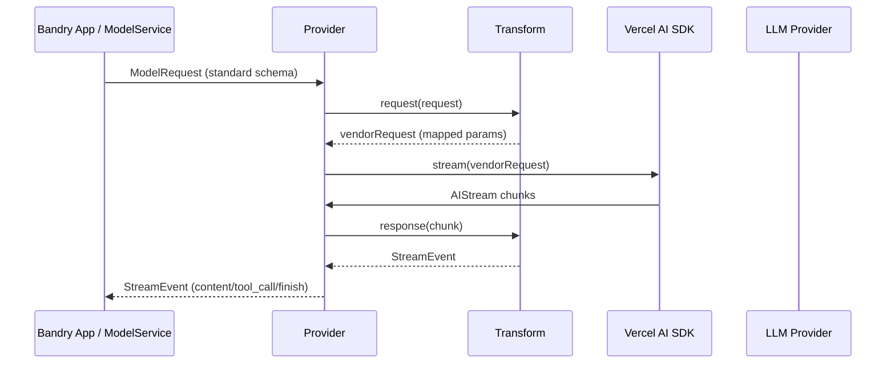

> **核心目标**：本文档旨在为 `Bandry` 项目提供一份简化且可落地的技术方案，核心是引入一套类似 `opencode` 的多模型统一接入架构。方案将聚焦于如何通过 **Provider/Registry/Transform/Stream** 的分层设计，实现模型热插拔、参数差异抹平与代码的长期可维护性。

## 1. 目标与总体架构

当前 `Bandry` 的模型调用直接耦合在具体业务逻辑中，这种方式在单一模型场景下简单直接，但缺乏扩展性，当需要引入更多模型（如 GPT-4, Claude 3, Llama 3）时，会导致代码大量重复、条件分支泛滥，且上层业务代码需要感知不同模型的参数差异，维护成本极高。

我们的目标是解耦业务逻辑与模型实现，构建一个统一的模型服务层。该层将负责：

- **统一接口**：无论后端调用哪个模型，都使用相同的接口和参数。
- **差异抹平**：自动处理不同模型厂商 API 的参数差异、特殊逻辑（如 System Prompt 的支持）和响应格式。
- **可扩展性**：新增一个模型厂商，只需添加一个独立的 `Provider` 文件，无需改动现有业务代码。

### 1.1. 端到端调用链架构

下图展示了从前端用户操作到最终调用模型厂商 API 的完整调用链路。核心在于引入了 `Model Service`、`Provider Registry` 和 `IProvider` 三个抽象层，它们构成了模型调用的“控制平面”和“执行平面”。


**核心流程解读**：

1. **前端触发**：用户在 `Bandry` 客户端发起操作，通过 `IPC` 通道将请求发送至后端 `API Server`。
2. **服务分发**：`API Server` 将请求转交给 `Model Service`，`Model Service` 是所有模型调用的统一入口。
3. **Provider 查找**：`Model Service` 根据请求中指定的 `modelId`，向 `Provider Registry`（模型注册表）查询对应的 `Provider` 实例。`Registry` 维护了所有可用模型的映射。
4. **统一接口调用**：`Model Service` 获取到 `Provider` 实例后，调用其统一的 `execute()` 方法，并传入标准化的请求参数。
5. **厂商适配与调用**：`Provider` 内部利用 `Vercel AI SDK` 等库，将标准化请求转换为特定厂商的 API 格式，并最终完成网络调用。流式响应也被包装成标准格式返回。

这种设计将“选择哪个模型”和“如何调用模型”彻底分离，使得 `Model Service` 只需与 `IProvider` 接口交互，无需关心底层是 OpenAI 还是 Anthropic。

## 2. Provider/Registry/Transform/Stream 分层设计

要实现上述架构，核心在于四个关键抽象的落地：

| 抽象层        | 职责                                                                                                                                | 关键实现                                                                                  |
| ------------- | ----------------------------------------------------------------------------------------------------------------------------------- | ----------------------------------------------------------------------------------------- |
| **Provider**  | **执行者**：封装单个模型厂商（或一类模型）的完整调用逻辑，包括认证、参数转换、API 调用和响应解析。                                  | 实现一个统一的 `IProvider` 接口，包含 `execute()` 或 `chat()` 方法。                      |
| **Registry**  | **目录**：维护一个从模型 ID 到 `Provider` 实例的映射表，负责模型的注册、发现和实例化。                                              | 一个单例或全局可访问的 `Map` 对象，在应用启动时加载所有 `Provider`。                      |
| **Transform** | **转换器**：负责在请求和响应阶段进行数据转换，抹平差异，是 `Provider` 的核心组成部分。                                              | 一个包含 `request()` 和 `response()` 方法的对象，用于处理特定模型的“方言”。               |
| **Stream**    | **标准化流**：将所有厂商返回的流式数据（无论是 SSE 还是其他格式）统一解析成标准的事件流（如 `onChunk`、`onToolCall`、`onFinish`）。 | 基于 `Vercel AI SDK` 的 `AIStream`，通过 `Transform.response()` 转换成内部统一的 Schema。 |

### 2.1. 模型切换与参数抹平数据流

下图详细描绘了数据在一个完整的请求-响应生命周期中是如何被 `Transform` 层处理，从而抹平差异的。



**数据流解读**：

1. **请求标准化**：当一个调用进入具体的 `Provider` 时，首先由 `Transform.request()` 接管。它会：
   - **注入 System Prompt**：对于不支持 `system` 角色的模型（如早期的某些模型），`Transform` 会将其内容合并到第一条 `user` 消息中。
   - **参数映射**：将标准参数（如 `frequency_penalty`）映射到厂商特定的名称（如 `frequencyPenalty`），或将 `top_k` 转换为 `top_p`（如果模型不支持 `top_k`）。
2. **厂商调用**：经过标准化的请求被传递给 `Vercel AI SDK` 的 `createCompletion` 或类似方法，后者处理底层的 HTTP 请求。
3. **响应流统一**：`Vercel AI SDK` 返回一个 `AIStream`。我们的代码通过 `Transform.response()` 对这个流进行逐块（Chunk）处理：
   - **解析工具调用**：从流式数据中提取并解析工具调用（Tool Calls）的片段，将其重组成完整的 JSON 对象。
   - **统一事件类型**：将厂商特定的事件（如 `text_delta`、`tool_use_chunk`）映射为我们内部的统一事件，如 `{ type: 'content_delta', delta: '...' }` 或 `{ type: 'tool_call', toolCall: {...} }`。
   - **错误和结束原因**：捕获并标准化错误信息和对话结束的原因（`Finish Reason`）。

通过这一层的处理，无论底层模型是什么，`Model Service` 接收到的总是一个可预测、格式统一的数据流。

## 3. 库选型与依赖清单

为了快速落地这套架构，我们将站在巨人的肩膀上，主要依赖 `Vercel AI SDK` 并配合一些社区优秀的工具库。

| 库                         | 用途说明                                                                                                                                          | 安装命令                                   |
| -------------------------- | ------------------------------------------------------------------------------------------------------------------------------------------------- | ------------------------------------------ |
| **ai**                     | **核心依赖**。Vercel AI SDK，提供了对主流 LLM 厂商（OpenAI、Anthropic、Google 等）的开箱即用支持，内置了流式处理、工具调用等能力。                | `pnpm add ai`                              |
| **zod**                    | **Schema 验证**。用于定义和验证我们内部的标准化请求/响应 Schema，确保数据在各层之间流转时的类型安全和结构正确。                                   | `pnpm add zod`                             |
| **pino** / **pino-pretty** | **日志记录**。高性能 JSON 日志库，用于记录模型调用的关键信息（请求/响应、耗时、错误），便于调试和监控；`pino-pretty` 用于在开发环境美化日志输出。 | `pnpm add pino && pnpm add -D pino-pretty` |
| **p-retry**                | **自动重试**。为模型调用增加健壮性。当遇到网络抖动或可恢复的服务端错误（如 `503 Service Unavailable`）时，可以自动进行指数退避重试。              | `pnpm add p-retry`                         |
| **p-queue**                | **并发控制**。用于限制对外部 API 的并发请求数量，避免因超出厂商的 Rate Limit 而导致请求失败。                                                     | `pnpm add p-queue`                         |

这些库共同构成了一个健壮、可观测且易于扩展的模型调用底层。

## 4. 标准化 Schema

定义一套清晰、稳定的内部数据结构（Schema）是实现差异抹平的基石。我们将使用 `zod` 来定义这些结构，确保在代码层面强制执行一致性。

### 4.1. 标准化请求 Schema

这是我们向任何 `Provider` 发送请求时使用的数据结构。它应包含所有主流模型支持的核心参数，并采用统一的命名。

```typescript
// file: src/ai/schema.ts
import { z } from "zod";

export const ModelRequestSchema = z.object({
  modelId: z.string(),
  messages: z.array(
    z.object({
      role: z.enum(["system", "user", "assistant", "tool"]),
      content: z.string(),
      tool_call_id: z.string().optional(),
    })
  ),
  tools: z.array(z.any()).optional(), // Zod schema for tools
  temperature: z.number().optional(),
  max_tokens: z.number().optional(),
  // ... 其他通用参数
});

export type ModelRequest = z.infer<typeof ModelRequestSchema>;
```

**解释**：

- `modelId` 用于在 `Registry` 中查找 Provider。
- `messages` 统一了角色类型。
- `tools` 定义了可用的工具列表。
- 所有参数都是可选的，`Provider` 会根据自身能力和默认值进行处理。

### 4.2. 标准化响应 Schema（流式）

对于流式响应，我们不直接返回原始数据块，而是定义一个标准化的“事件”对象。

```typescript
// file: src/ai/schema.ts
import { z } from "zod";

export const StreamEventSchema = z.discriminatedUnion("type", [
  z.object({ type: z.literal("content_delta"), delta: z.string() }),
  z.object({ type: z.literal("tool_call_delta"), delta: z.any() }),
  z.object({ type: z.literal("finish"), reason: z.string(), usage: z.any() }),
  z.object({ type: z.literal("error"), error: z.string() }),
]);

export type StreamEvent = z.infer<typeof StreamEventSchema>;
```

**解释**：

- 使用 `discriminatedUnion` 确保每个事件对象都有一个明确的 `type`。
- `content_delta` 代表文本内容的增量。
- `tool_call_delta` 代表工具调用 JSON 的增量部分。
- `finish` 标志着流的结束，并携带结束原因和 token 使用量。
- `error` 用于在流中传递错误信息。

上层业务逻辑只需 `switch (event.type)` 即可处理所有情况，完全无需关心底层模型。

## 5. 测试与验证方案

为了确保这套复杂架构的稳定性和正确性，我们需要建立一个分层的测试策略。

### 5.1. 单元测试（Unit Tests）

- **覆盖点**：主要覆盖 `Transform` 层。为每个支持的模型编写测试，验证其 `request()` 和 `response()` 方法是否能正确转换数据。
- **断言要点**：
  - `request()`：断言 system prompt 是否被正确合并、参数名是否被正确映射。
  - `response()`：模拟 `Vercel AI SDK` 的流式输出，断言 `Transform` 是否能逐块解析并生成正确的 `StreamEvent` 序列，特别是对于复杂的工具调用 JSON。

**样例代码片段**（`vitest`）：

```typescript
// file: src/ai/providers/anthropic.transform.test.ts
import { expect, test } from "vitest";
import { anthropicTransform } from "./anthropic.transform";

test("should merge system prompt for anthropic", () => {
  const messages = [
    { role: "system", content: "You are a helpful assistant." },
    { role: "user", content: "Hello!" },
  ];
  const transformed = anthropicTransform.request({ messages });

  expect(transformed.system).toBe("You are a helpful assistant.");
  expect(transformed.messages[0].role).toBe("user");
});
```

### 5.2. 集成测试（Integration Tests）

- **覆盖点**：覆盖 `Provider` 层。通过 mock `Vercel AI SDK` 的 API 调用，测试每个 `Provider` 的 `execute()` 方法是否能与 `Transform` 正确协作，处理完整的请求-响应流程。
- **断言要点**：
  - 断言 `p-retry` 在遇到可重试错误时是否执行了重试逻辑。
  - 断言 `p-queue` 是否限制了并发。
  - 断言 `Provider` 返回的流是否符合 `StreamEventSchema` 规范。

### 5.3. E2E（最小化验证）

- **覆盖点**：创建一个简单的测试脚本，真实地调用一到两个主流模型（如 OpenAI 和 Anthropic）的免费或低成本版本。
- **断言要点**：
  - **基本对话**：发送一个简单问题，断言能否收到包含预期文本的流式响应。
  - **工具调用**：发送一个需要调用工具的指令，断言能否收到包含正确工具调用名称和参数的 `tool_call` 事件。

**样例代码片段**（Node.js 脚本）：

```typescript
// file: scripts/verify-provider.ts
import { modelService } from "../src/ai/model-service";

async function verifyOpenAI() {
  const stream = await modelService.chat({
    modelId: "openai:gpt-4o-mini",
    messages: [{ role: "user", content: "Hello!" }],
  });

  for await (const event of stream) {
    if (event.type === "content_delta") {
      process.stdout.write(event.delta);
    }
  }
  // 断言最终输出包含 "Hello"
}
```

## 6. 目录结构与最小骨架代码

我们建议在 `src/` 下创建一个 `ai/` 目录来组织所有与模型层相关的代码。

```text
src/
└── ai/
    ├── providers/                # 存放所有模型 Provider 的实现
    │   ├── _registry.ts          # 模型注册表
    │   ├── openai.provider.ts    # OpenAI Provider
    │   ├── anthropic.provider.ts # Anthropic Provider
    │   └── ...                   # 其他 Provider
    ├── stream.ts                 # 流式处理工具
    ├── transform.ts              # Transform 接口和通用逻辑
    ├── schema.ts                 # Zod Schemas (请求/响应)
    ├── service.ts                # ModelService 统一入口
    └── index.ts                  # 导出公共接口和实例
```

### 6.1. Provider 接口与实现

```typescript
// file: src/ai/providers/base.provider.ts
import { ModelRequest, StreamEvent } from "../schema";

export interface IProvider {
  readonly id: string;
  execute(request: ModelRequest): AsyncIterable<StreamEvent>;
}
```

**解释**：这是所有 `Provider` 必须实现的接口，定义了统一的 `execute` 方法，其返回一个异步可迭代的 `StreamEvent` 流。

```typescript
// file: src/ai/providers/openai.provider.ts
import { OpenAI } from "ai/openai";
import { createOpenAI } from "@ai-sdk/openai";

const openai = createOpenAI({ apiKey: process.env.OPENAI_API_KEY });

export const openAIProvider: IProvider = {
  id: "openai",
  async *execute(request) {
    // 1. 调用 transform.request() 转换请求
    // 2. 调用 Vercel AI SDK
    // 3. 循环处理返回的 AIStream
    // 4. 调用 transform.response() 转换为 StreamEvent 并 yield
  },
};
```

**解释**：这是一个 `Provider` 的最小实现骨架。它会引入 Vercel AI SDK 的客户端，并在 `execute` 方法中完成请求转换、调用和响应流的标准化。

### 6.2. Registry 实现

```typescript
// file: src/ai/providers/_registry.ts
import { IProvider } from "./base.provider";
import { openAIProvider } from "./openai.provider";
import { anthropicProvider } from "./anthropic.provider";

export const providerRegistry = new Map<string, IProvider>();

// 注册所有内置 Provider
[openAIProvider, anthropicProvider].forEach((p) => {
  // 可以根据 id 注册多个模型，例如 'gpt-4', 'gpt-3.5-turbo'
  providerRegistry.set(p.id, p);
});
```

**解释**：`_registry.ts` 负责导入所有 `Provider` 并将其实例注册到一个全局的 `Map` 中，`ModelService` 将通过这个 `Map` 来查找 `Provider`。

### 6.3. Model Service

```typescript
// file: src/ai/service.ts
import { providerRegistry } from "./providers/_registry";
import { ModelRequest, ModelRequestSchema } from "./schema";

class ModelService {
  async chat(request: ModelRequest) {
    ModelRequestSchema.parse(request); // 验证入参

    const provider = providerRegistry.get(request.modelId.split(":")[0]);
    if (!provider) {
      throw new Error(`Provider not found for model: ${request.modelId}`);
    }

    return provider.execute(request);
  }
}

export const modelService = new ModelService();
```

**解释**：`ModelService` 是上层业务的唯一入口。它负责验证请求、从 `Registry` 查找 `Provider`，然后调用其 `execute` 方法，并将结果流直接返回给调用方。

## 7. 开发落地 Plan

我们将分三个阶段来落地这套架构，确保每一步都是小步快跑、可验证的。

### 阶段一：最小可用路径（MVP）

- **目标**：打通一个主流模型（如 OpenAI）的完整调用链路。
- **步骤**：
  1. 创建 `src/ai` 目录结构，并实现 `IProvider`、`ModelService`、`schema.ts` 的基本骨架。
  2. 实现一个最简 `OpenAIProvider`，`Transform` 层暂时可以很简单，甚至不做转换。
  3. 实现 `Registry`，手动注册 `OpenAIProvider`。
  4. 改造 `Bandry` 现有的一处模型调用代码，使其通过 `modelService.chat()` 来发起请求。
  5. 编写一个最小化的 E2E 测试脚本，验证可以成功与 OpenAI API 通信并获得流式响应。
- **产出**：一个可以工作的、基于新架构的 OpenAI 调用。

### 阶段二：完善抽象与多厂商支持

- **目标**：完善 `Transform` 抽象，并增加对另一个主流模型（如 Anthropic）的支持，验证模型切换能力。
- **步骤**：
  1. 详细设计 `Transform` 接口，并为 `OpenAIProvider` 实现完整的 `request` 和 `response` 转换逻辑。
  2. 新增 `AnthropicProvider`，并为其编写对应的 `Transform`，特别注意 `system` prompt 和 `stop_sequences` 的处理。
  3. 在 `Registry` 中注册 `AnthropicProvider`。
  4. 扩展 E2E 测试脚本，增加对 Anthropic 模型的验证，断言两者返回的 `StreamEvent` 格式一致。
  5. 引入 `p-retry` 和 `pino`，为 `Provider` 增加重试和日志能力。
- **产出**：两个可无缝切换的 `Provider`，以及更健壮的 `Transform` 和 `Provider` 实现。

### 阶段三：全面推广与稳定性建设

- **目标**：将项目中所有模型调用都迁移到新架构，并完善工具调用、并发控制等高级功能。
- **步骤**：
  1. 全面梳理 `Bandry` 代码库，将所有硬编码的模型调用全部替换为 `modelService.chat()`。
  2. 为 `Transform` 层增加完整的工具调用解析和标准化逻辑。
  3. 在 `ModelService` 或 `Provider` 层面引入 `p-queue` 来进行全局或每个 `Provider` 的并发控制。
  4. 编写更全面的集成测试，覆盖错误处理、重试、工具调用等场景。
  5. 在 `Bandry` 的 UI 层面提供模型切换的选项，让用户可以动态选择使用的模型。
- **产出**：一个完全基于新架构、支持多模型、健壮且易于扩展的 `Bandry` 应用。

## 8. 阶段性验收标准

- **阶段一完成**：

  - ✅ 能够通过 `modelService.chat({ modelId: 'openai:gpt-4o-mini', ... })` 成功获取流式响应。
  - ✅ `src/ai` 目录结构已建立，核心文件骨架已存在。
  - ✅ 至少有一个 E2E 测试用例可以通过。

- **阶段二完成**：

  - ✅ 能够通过 `modelId` 在 `openai` 和 `anthropic` 模型之间无缝切换，上层代码无任何改动。
  - ✅ `Transform` 层能够正确处理 `system` prompt 的差异。
  - ✅ 模型调用的关键步骤（请求、响应、错误）都有结构化日志输出。
  - ✅ 单元测试覆盖了 `Transform` 的核心转换逻辑。

- **阶段三完成**：
  - ✅ `Bandry` 项目中不再有任何直接调用厂商 SDK 的代码。
  - ✅ 支持至少一个模型的工具调用功能，并有 E2E 测试覆盖。
  - ✅ 对外 API 的请求并发得到有效控制。
  - ✅ `Bandry` 的设置界面允许用户选择不同的模型进行对话。

通过以上设计和实施路径，`Bandry` 将获得一个与 `opencode` 类似但更轻量、更易于理解和维护的统一模型层，为未来的功能扩展和演进奠定坚实的基础。
